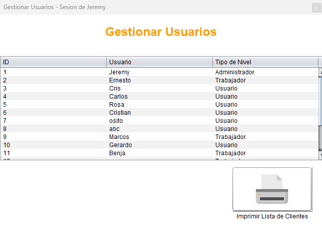

# Gtrucks

Aplicación utilizada para gestionar la salida de camiones, remolques y viajes.

  
  
  
  

## Instalación

1. [Descargar JDK o Kit de desarrollo en Java](https://www.oracle.com/cl/java/technologies/javase/javase8-archive-downloads.html)
2. [Descargar XAMPP para iniciar un sql-server]([https://www.apachefriends.org/es/download.html])

3. Tienes todos los permisos para interactuar en la base de datos
4. Si quieres ver la base de datos despues de iniciar XAMPP, usa: [http://localhost/phpmyadmin](http://localhost/phpmyadmin)

## Login

Puedes iniciar sesión como **administrador**, **trabajador** o **usuario**.  
Cada uno de ellos escala distintos **privilegios** en la aplicación.

## Administrador

### Panel de vista del Administrador

### Registrar usuarios

### Gestionar usuarios

## Trabajador

### Panel de vista del Trabajador

### Registrar camión

### Registrar remolque

### Registrar viaje

### Gestionar camiones

### Gestionar remolques

### Gestionar viajes

## Usuario

### Panel de vista del usuario

### Vista general de la aplicación

